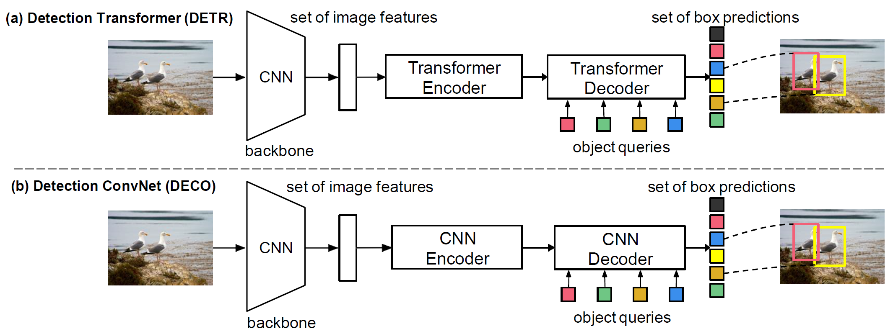

# DECO
### **DECO: Query-Based End-to-End Object Detection with ConvNets**

*Xinghao Chen\*, Siwei Li\*, Yijing Yang, Yunhe Wang (\*Equal Contribution)*

*arXiv 2023* 

[[`arXiv`](https://arxiv.org/abs/2312.13735)] [[`BibTeX`](#citation)]

## Updates
* **2024/10/03**: Update pre-trained models and codes for ConvNeXt backbone.
* **2024/02/04**: Pre-trained models and codes of DECO are released both in [Pytorch](https://github.com/xinghaochen/DECO) and [Mindspore](https://github.com/mindspore-lab/models/tree/master/research/huawei-noah/DECO).

## Overview

Detection ConvNet (**DECO**) is a simple yet effective query-based end-to-end object detection framework, which is composed of a backbone and convolutional encoder-decoder architecture. Our DECO model enjoys the similar favorable attributes as DETR. We compare the proposed DECO against prior detectors on the challenging COCO benchmark. Despite its simplicity, our DECO achieves competitive performance in terms of detection accuracy and running speed. Specifically, with the ResNet-50 and ConvNeXt-Tiny backbone, DECO obtains 38.6% and 40.8% AP on COCO val set with 35 and 28 FPS respectively. We hope the proposed DECO brings another perspective for designing object detection framework.

<div align="center">
  
</div><br/>

## Main Results

Here we provide the pretrained `DECO` weights.

| Detector | Backbone  | Epochs | Queries| AP (%) | Download |
| ------------------- | -------- | ------- |------- |------- |------- |
| DECO | R-50 | 150 | 100 | 38.8 | [deco_r50_150e.pth](https://github.com/xinghaochen/DECO/releases/download/1.0/deco_r50_150e.pth)
| DECO | ConvNeXt-Tiny | 150 | 100 | 40.8 | [deco_convnextTiny1K_150.pth](https://github.com/xinghaochen/DECO/releases/download/1.0/deco_convnextTiny1K_150.pth)

## Installation
```bash
pip install torch==1.8.0 torchvision==0.9.0
pip install pycocotools
pip install timm
```

## Training

```bash
python -m torch.distributed.launch --nproc_per_node=4 --use_env main.py --backbone resnet50 --batch_size 2 --coco_path {your_path_to_coco} --output_dir {your_path_for_outputs} # 4 gpus example
```
By default, we use 4 GPUs with total batch size as 8 for training DECO with ResNet-50 backbone.

## Evaluation
Model evaluation can be done as follows:

```bash
python eval.py --backbone resnet50 --batch_size 1 --coco_path {your_path_to_coco} --ckpt_path {your_path_to_pretrained_ckpt}
```
```bash
Results of DECO with ResNet-50 backbone:
IoU metric: bbox
 Average Precision  (AP) @[ IoU=0.50:0.95 | area=   all | maxDets=100 ] = 0.388
 Average Precision  (AP) @[ IoU=0.50      | area=   all | maxDets=100 ] = 0.588
 Average Precision  (AP) @[ IoU=0.75      | area=   all | maxDets=100 ] = 0.411
 Average Precision  (AP) @[ IoU=0.50:0.95 | area= small | maxDets=100 ] = 0.199
 Average Precision  (AP) @[ IoU=0.50:0.95 | area=medium | maxDets=100 ] = 0.431
 Average Precision  (AP) @[ IoU=0.50:0.95 | area= large | maxDets=100 ] = 0.555
 Average Recall     (AR) @[ IoU=0.50:0.95 | area=   all | maxDets=  1 ] = 0.320
 Average Recall     (AR) @[ IoU=0.50:0.95 | area=   all | maxDets= 10 ] = 0.522
 Average Recall     (AR) @[ IoU=0.50:0.95 | area=   all | maxDets=100 ] = 0.556
 Average Recall     (AR) @[ IoU=0.50:0.95 | area= small | maxDets=100 ] = 0.297
 Average Recall     (AR) @[ IoU=0.50:0.95 | area=medium | maxDets=100 ] = 0.607
 Average Recall     (AR) @[ IoU=0.50:0.95 | area= large | maxDets=100 ] = 0.798
```

```bash
Results of DECO with ConvNeXt-Tiny backbone:
IoU metric: bbox
 Average Precision  (AP) @[ IoU=0.50:0.95 | area=   all | maxDets=100 ] = 0.408
 Average Precision  (AP) @[ IoU=0.50      | area=   all | maxDets=100 ] = 0.615
 Average Precision  (AP) @[ IoU=0.75      | area=   all | maxDets=100 ] = 0.436
 Average Precision  (AP) @[ IoU=0.50:0.95 | area= small | maxDets=100 ] = 0.211
 Average Precision  (AP) @[ IoU=0.50:0.95 | area=medium | maxDets=100 ] = 0.455
 Average Precision  (AP) @[ IoU=0.50:0.95 | area= large | maxDets=100 ] = 0.579
 Average Recall     (AR) @[ IoU=0.50:0.95 | area=   all | maxDets=  1 ] = 0.330
 Average Recall     (AR) @[ IoU=0.50:0.95 | area=   all | maxDets= 10 ] = 0.534
 Average Recall     (AR) @[ IoU=0.50:0.95 | area=   all | maxDets=100 ] = 0.569
 Average Recall     (AR) @[ IoU=0.50:0.95 | area= small | maxDets=100 ] = 0.318
 Average Recall     (AR) @[ IoU=0.50:0.95 | area=medium | maxDets=100 ] = 0.622
 Average Recall     (AR) @[ IoU=0.50:0.95 | area= large | maxDets=100 ] = 0.805
```


## Citing DECO
If you find our work helpful for your research, please consider citing the following BibTeX entry.

```BibTex
@misc{chen2023deco,
      title={DECO: Query-Based End-to-End Object Detection with ConvNets}, 
      author={Xinghao Chen and Siwei Li and Yijing Yang and Yunhe Wang},
      year={2023},
      eprint={2312.13735},
      archivePrefix={arXiv},
      primaryClass={cs.CV}
}
